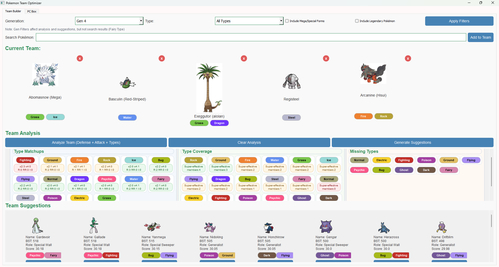
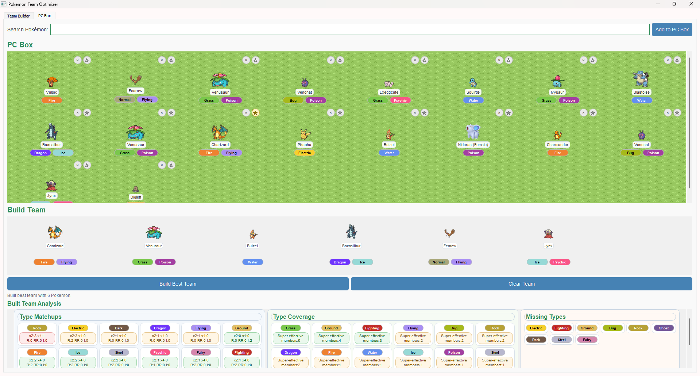

# Pokemon Team Builder / Optimizer

Pokemon Team Optimizer is a desktop tool for building stronger teams from your available Pokemon, comparing type matchups, and quickly testing different team combinations.

## Screenshots





## Features

- **Team Builder**: Create and analyze a team of up to 6 Pokemon.
  - Search Pokemon by name or form, including flexible matching for special forms.
  - Filter by generation, type, legendary status, and special forms.
  - Add Pokemon directly from autofill results.
  - Remove Pokemon directly from team cards.
  - View colored type badges, suggestions, and team analysis in one place.

- **PC Box**: Store Pokemon and build teams from your collection.
  - Add Pokemon to a larger PC box.
  - Star Pokemon that must be included in the built team.
  - Remove Pokemon directly from box cards.
  - Build the best team from the box while respecting starred Pokemon.
  - View the built team and its analysis directly in the PC Box tab.

- **Team Analysis**:
  - Combined defensive matchup view with weaknesses and resistances in one layout.
  - Offensive coverage overview.
  - Missing type summary.
  - Color-coded severity indicators for quick scanning.

- **Suggestions**:
  - Generate team improvement suggestions from your current team.
  - Add suggested Pokemon directly to the team.
  - Suggestions respect the current filters and generation context.

## Current Limitations

- Resistance and immunity calculations do not yet include abilities.
- Role detection such as sweeper or wall is currently based only on fixed BST/stat thresholds.
- Movesets are not considered in role detection or team scoring.
- These parts may be improved later if a better dataset becomes available.

## Installation

1. Clone the repository:
```bash
git clone https://github.com/andresbucher/pokemon_team_optimizer.git
cd pokemon_team_optimizer
```

2. Install dependencies:
```bash
pip install -r requirements.txt
```

3. Run the application:
```bash
python Main.py
```

## Usage

### Team Builder
1. Launch the application using `python Main.py`
2. Search for Pokemon by name or form
3. Apply filters to narrow the available pool
4. Add Pokemon directly to the team and remove them with the card controls
5. Use the analysis and suggestion tools to refine the team

### PC Box
1. Add Pokemon to the PC Box from the search bar
2. Star Pokemon you want locked into a built team
3. Click Build Best Team to assemble a team from the box
4. Review the built team and the team analysis below the PC Box controls
5. Remove Pokemon from the box or clear the team when needed

### Analysis
1. Open Team Builder or PC Box analysis
2. Review type matchups, offensive coverage, and missing types
3. Use the color-coded tiles to spot danger and coverage quickly

### Suggestions
1. Generate suggestions from the current team
2. Add a suggested Pokemon directly with the Add to Team button
3. Use them as a starting point for testing alternatives

## Requirements

```
pandas==1.3.5
PyQt5==5.15.4
beautifulsoup4==4.10.0
requests==2.27.1
```

## Project Structure

```
pokemon_team_optimizer/
├── Main.py              # Application entry point
├── src/
│   ├── logic/           # Team analysis, role detection, and suggestions
│   ├── ui/              # Main window and tab widgets
│   └── utils/           # Data loading and image helpers
└── data/                # Pokemon database, JSON config, and images
```

## License

This project is licensed under the MIT License - see the LICENSE file for details.

## Acknowledgements
Pokemon data sourced from PokeAPI.
Type effectiveness calculations based on official Pokemon game mechanics.
